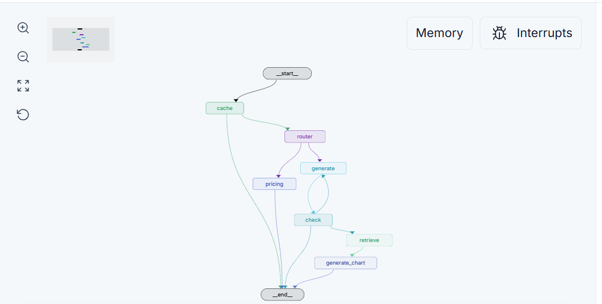

# Bienvenue sur MidOff-AI

Projet de fin d'études (PFE) — CDG Capital Middle Office

    
MidOffAI in LangGraph Studio

    

        
    

## Stack technique
- **Frontend** : Next.js 15, TypeScript, Tailwind CSS
- **Backend** : FastAPI (Python 3.10+)
- **Authentification** : Keycloak (OpenID Connect)
- **Orchestration** : LangChain,LangGraph
- **Conteneurisation** : Docker & Docker-compose

## Fonctionnalités principales
- Authentification SSO Keycloak (login, logout, gestion des rôles)
- Dashboard interactif Middle/Back Office
- Gestion des utilisateurs et des droits
- API sécurisée et documentation Swagger
